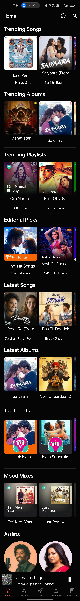
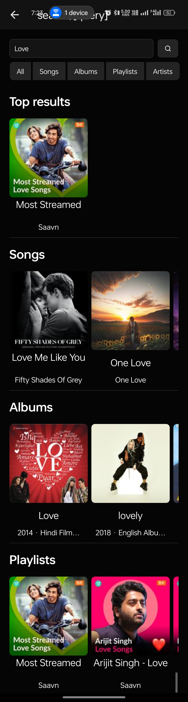
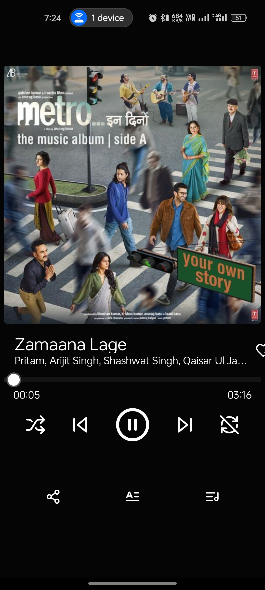

# 🎧 Britify

[](https://expo.dev)
[](https://tamagui.dev)
[](#)
[](LICENSE)
[](https://github.com/doublesymmetry/react-native-track-player)

Britify is a modern and elegant music streaming app built with **Expo**, **Tamagui**, and **react-native-track-player**. It offers a fast, beautifully styled experience for music lovers on Android.

---

## 📚 Table of Contents

- [Features](#-features)
- [Installation](#-installation)
- [Deep Linking](#-deep-linking)
- [Screenshots](#-screenshots)
- [Contributing](#-contributing)
- [License](#-license)
- [Tech Stack](#-tech-stack)
- [Contact](#-contact)

---

## 📱 Features

- 🎵 **Home**: Browse curated content and personalized sections
- 🔥 **Trending**: Explore what's hot by type and language (`/trending/:type/:lang`)
- 🌟 **Featured**: Highlighted content by language (`/featured/:lang`)
- 🆕 **Latest**: Discover newly added music (`/latest/:lang`)
- ❤️ **Library**: Access your favorites and saved content
- 🔍 **Search**: Find songs, artists, albums, and playlists
- 📈 **Top Charts**: Stay updated with the best
- ⚡ **Fast Navigation**: Deep linking supported for all major routes
- 📦 **Library**: Local storage powered by `expo-sqlite`
- 🎧 **Gapless Playback**: High-performance audio with `react-native-track-player`

---

## 🚀 Installation

### 🔧 Option 1: Download APK (Recommended)

1. [Download the latest signed APK from the Releases tab](https://github.com/LakhindarPal/britify/releases)
2. Install on your Android device
3. Enjoy the music 🎶

### 🛠 Option 2: Run Locally (Dev Mode)

> Requires Node.js, Expo CLI, and Git installed.

```bash
git clone https://github.com/LakhindarPal/britify.git
cd britify
yarn
npx expo android
```

> To run on a device, you need expo dev build as react-native-track-player does not support Expo Go.

---

## 🖼 Screenshots

### Home page



### Search page



### Player page



---

## 🤝 Contributing

Contributions are welcome! Please follow these steps:

1. Fork the repo
2. Create your feature branch: `git checkout -b feature/your-feature`
3. Commit your changes: `git commit -m "Add your feature"`
4. Push to the branch: `git push origin feature/your-feature`
5. Open a Pull Request

---

## 📄 License

This project is licensed under the [MIT License](LICENSE).

---

## ✨ Tech Stack

- ⚛️ React Native via [Expo](https://expo.dev/)
- 🎨 UI with [Tamagui](https://tamagui.dev/)
- 🎧 Audio Playback: [react-native-track-player](https://github.com/doublesymmetry/react-native-track-player)
- 💾 Local Storage: [expo-sqlite](https://docs.expo.dev/versions/latest/sdk/sqlite/)

---

## 📬 Contact

Feel free to reach out with questions, suggestions, or collaborations!

---

Made with ❤️ using open source tools.
